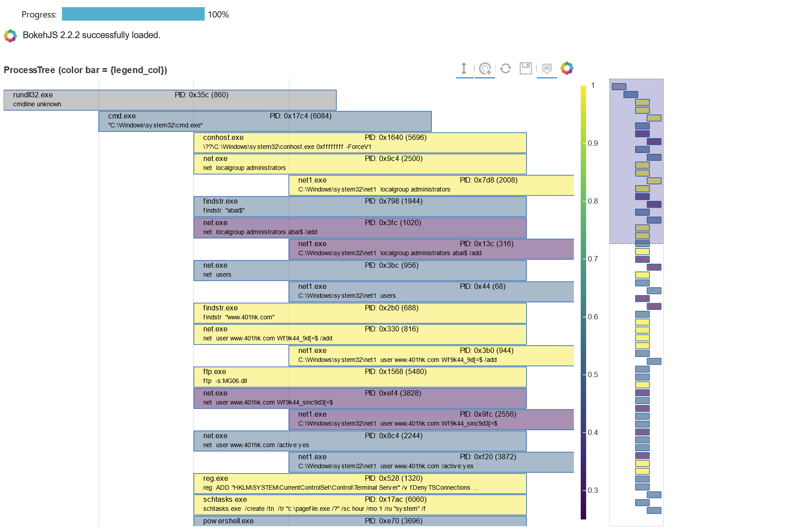

# Notebooks for PyCon2021 and the Launch Space

## The Launch Space - MS Learn TV

[LearnTV-Msticpy](./LearnTV-Msticpy.ipynb) - overview and introductory tour.

[Extending-Msticpy](./Extending-MSTICPy.ipynb) - extending and customizing MSTICPy.

## PyCon-MSTICPy

[This notebook](./PyCon-Msticpy.ipynb) is an overview of some of the features of MSTICPy.

## PyCon-MP-Dev

[This notebook](./PyCon-MP-dev.ipynb) discusses, with example code, some of the extensibility
and usability techniques used in MSTICPy.

## Resources

MSTICPy Documentation - https://msticpy.readthedocs.io 
GitHub repo - https://github.com/microsoft/msticpy 
Blog - https://msticpy.medium.com 
Introductory articles
- <a href="https://msticpy.medium.com/msticpy-v1-0-0-and-jupyter-notebooks-in-azure-sentinel-an-update-ac2f6df61f9e?source=friends_link&sk=721420baba0796878bf6c1147a28512d">MSTICPy overview</a>
- <a href="https://techcommunity.microsoft.com/t5/azure-sentinel/msticpy-and-jupyter-notebooks-in-azure-sentinel-an-update/ba-p/2279661">MSTICPy overview for Azure Sentinel users</a>

### Sample notebooks:
- https://github.com/microsoft/msticpy/tree/master/docs/notebooks
- https://github.com/Azure/Azure-Sentinel-Notebooks
- MSTICPy sample notebooks 
  Try the EventTimeLine and ProcessTree notebooks
- Simple machine learning 

## Contacts

Email - msticpy@microsoft.com 
Twitter - @ianhellen, @MSSPete (Pete Bryan) @AshwinPatil (Ashwin Patil) 
GitHub - @ianhelle (Note the missing last "n"\), @PeteBryan, @AshwinPatil 
LinkedIn - @ianhellen, @PeteBryan, @AshwinPatil
